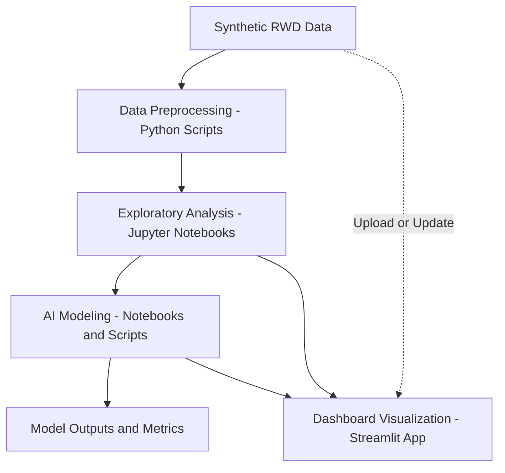

# ---
title: Oncology AI Insights
emoji: 🧬
colorFrom: blue
colorTo: green
sdk: streamlit
app_file: dashboard/app.py
python_version: 3.9
tags:
	- streamlit
	- oncology
	- ai
	- dashboard
	- real-world-data
license: mit
# ---
# AI-Powered Oncology Insights Platform

## Overview

**Live Demo:** [Hugging Face Space](https://huggingface.co/spaces/zhangju2023/oncology-ai-insights)

This project demonstrates how AI and real-world data (RWD) can be leveraged to extract actionable insights in oncology. It simulates a workflow for clinical decision support, drug development, and patient outcome prediction using synthetic data and modern AI tools.

## Project Workflow




## Features
- **Synthetic Oncology Data**: Simulated EHR, genomics, and treatment datasets.
- **NLP Pipelines**: Extract cancer staging, treatments, and adverse events from unstructured clinical notes.
- **Predictive Modeling**: Forecast patient survival or treatment response using XGBoost/LightGBM.
- **Clustering**: Identify patient subgroups with similar biomarker or treatment profiles.
- **Interactive Dashboards**: Visualize trends and model outputs with Streamlit or Dash.

## Directory Structure
```
📦 oncology-ai-insights/
├── README.md                # Project overview, goals, and demo instructions
├── data/                    # Synthetic or anonymized RWD samples
├── notebooks/               # Jupyter notebooks for analysis and modeling
├── src/                     # Python scripts for preprocessing, modeling, and visualization
├── models/                  # Saved model files and evaluation metrics
├── dashboard/               # Streamlit or Dash app code
└── docs/                    # Documentation and references
```

## Getting Started
1. Clone the repository.
2. Install requirements (see `docs/requirements.txt` or notebook cells).
3. Explore the notebooks for data analysis and modeling.
	- [View the data exploration notebook](https://github.com/justin-mbca/oncology-ai-insights/blob/main/notebooks/01_data_exploration.ipynb)
4. Run the dashboard app for interactive visualizations.

## AI Tools & Techniques
| Tool/Technique        | Purpose                                                                 |
|----------------------|-------------------------------------------------------------------------|
| NLP                  | Extract clinical features from text                                      |
| XGBoost/LightGBM     | Predict outcomes                                                        |
| K-Means/DBSCAN       | Patient subgroup discovery                                              |
| Plotly/Streamlit     | Data visualization and dashboards                                       |
| Faker/Synthea        | Synthetic data generation                                               |

## Impact
This project illustrates how AI can:
- Support oncologists in making data-driven decisions
- Identify clinical trial candidates
- Uncover hidden patterns in oncology RWD

## Credits
Inspired by real-world oncology data science and Ontada-style data models.

---

*For demo purposes only. No real patient data is used.*
